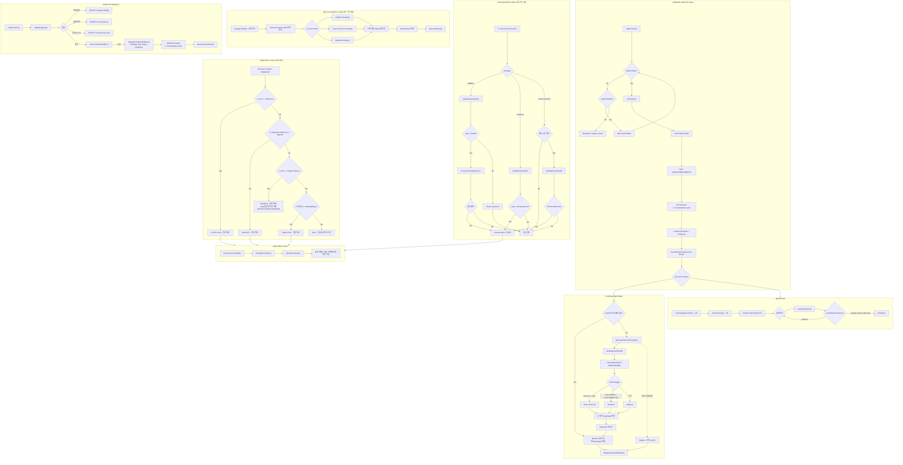

# Traveler Trading Daemon - Flow Diagram

## 전략별 설정

| | Pullback | Mean Reversion | Breakout |
|---|---|---|---|
| **무효화** | close < MA20 2일 연속 | RSI<35 + BB하단 (2일후) | close < 돌파레벨 |
| **Time Stop** | 7 거래일 | 5 거래일 | 15 거래일 |
| **Target1** | 1.5R | MA20 (평균회귀) | 1.5R |
| **Target2** | 2.5R | BB 상단 | 3.0R |

## 청산 우선순위

1. **손절** (price <= StopLoss) — 리스크 제한
2. **익절** (Target1 → Target2) — 수익 실현
3. **전략 무효화** (장 시작 1회) — 틀린 트레이드 자르기
4. **Time Stop** (N거래일 초과) — 안 움직이는 트레이드 자르기

## 파일 경로

- **PlanStore**: `~/.traveler/plans.json`
- **Daily Reports**: `~/.traveler/daily_YYYY-MM-DD.json`
